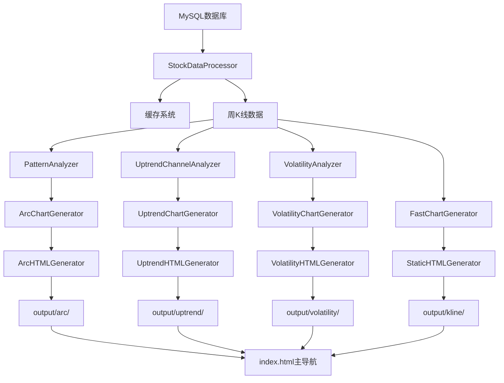

# A股技术分析平台 - 项目结构与流程文档

## 📋 项目概述

这是一个专业级的A股技术分析工具集，基于TA-Lib与机器学习算法，提供多维度的股票技术分析功能。项目采用模块化设计，支持大弧底检测、上升通道分析、波动率分析、K线图展示和相似度分析等核心功能。

## 🏗️ 项目架构

### 整体架构设计模式
```
┌─────────────────┐    ┌─────────────────┐    ┌─────────────────┐
│   主程序入口     │───▶│   数据处理层     │───▶│   分析器层       │
│  (main_*.py)   │    │ StockDataProcessor│    │ PatternAnalyzer │
└─────────────────┘    └─────────────────┘    └─────────────────┘
         │                       │                       │
         ▼                       ▼                       ▼
┌─────────────────┐    ┌─────────────────┐    ┌─────────────────┐
│   图表生成层     │    │   HTML生成层     │    │   输出展示层     │
│ ChartGenerator  │    │ HTMLGenerator   │    │ HTML/Images     │
└─────────────────┘    └─────────────────┘    └─────────────────┘
```

### 核心设计模式
1. **策略模式**: 不同分析器实现相同的分析接口
2. **工厂模式**: 图表生成器根据类型创建不同的图表
3. **缓存模式**: 数据处理器使用缓存提升性能
4. **模板模式**: HTML生成器使用统一的模板结构

## 📁 目录结构详解

```
week/
├── 📄 主程序入口文件
│   ├── main_arc.py          # 大弧底形态检测主程序
│   ├── main_kline.py        # K线图生成主程序  
│   ├── main_similarity.py   # 相似度分析主程序
│   ├── main_uptrend.py      # 上升通道分析主程序
│   └── main_volatility.py   # 波动率分析主程序
│
├── ⚙️ 配置与运行
│   ├── config/settings.py   # 全局配置文件
│   ├── requirements.txt     # Python依赖包
│   └── run_in_stock_env.sh  # 环境运行脚本
│
├── 🧠 核心源代码 (src/)
│   ├── core/                # 核心数据处理模块
│   │   └── stock_data_processor.py  # 数据加载、处理、缓存
│   │
│   ├── analyzers/           # 分析器模块
│   │   ├── pattern_analyzer.py      # 形态分析器(大弧底)
│   │   ├── uptrend_channel_analyzer.py  # 上升通道分析器
│   │   └── volatility_analyzer.py   # 波动率分析器
│   │
│   ├── generators/          # 生成器模块
│   │   ├── base_chart_generator.py     # 图表生成基类
│   │   ├── chart_generator.py          # 快速K线图生成器
│   │   ├── arc_chart_generator.py      # 大弧底图表生成器
│   │   ├── uptrend_chart_generator.py  # 上升通道图表生成器
│   │   ├── html_generator.py           # 基础HTML生成器
│   │   ├── arc_html_generator.py       # 大弧底HTML生成器
│   │   ├── uptrend_html_generator.py   # 上升通道HTML生成器
│   │   └── volatility_html_generator.py # 波动率HTML生成器
│   │
│   └── similarity/          # 相似度分析模块
│       └── image_similarity.py        # 图像相似度算法
│
├── 💾 数据与缓存
│   ├── cache/              # 数据缓存目录
│   └── output/             # 分析结果输出目录
│       ├── index.html      # 主导航页面
│       ├── arc/            # 大弧底分析结果
│       ├── kline/          # K线图结果
│       ├── uptrend/        # 上升通道分析结果
│       ├── volatility/     # 波动率分析结果
│       └── similarity/     # 相似度分析结果
│
└── 📚 文档
    ├── README.md           # 项目主文档
    └── PROJECT_STRUCTURE_AND_FLOW.md  # 本文档
```

## 🔄 核心流程详解

### 1. 数据处理流程 (StockDataProcessor)

```python
数据加载 → 缓存检查 → 数据清洗 → 周K线转换 → 缓存保存 → 数据输出
```

**核心功能:**
- 数据库读取（MySQL，实时）
- 智能缓存机制(pickle)
- 日K线到周K线的聚合转换
- 数据清洗和验证
- 批量数据处理

**关键方法:**
```python
load_data()           # 连接数据库
process_weekly_data() # 从数据库加载周K线数据
get_all_data()        # 获取处理后的数据
_is_cache_valid()     # 缓存有效性检查
```

### 2. 分析器流程 (Analyzers)

#### PatternAnalyzer (大弧底检测)
```python
价格数据输入 → TA-Lib指标计算 → 形态检测 → 质量评分 → 结果输出
```

**核心算法:**
- 二次拟合检测弧形特征
- TA-Lib技术指标增强(158个指标)
- 多维度质量评分系统
- 相似度分析回退机制

#### UptrendChannelAnalyzer (上升通道检测)
```python
价格数据输入 → 关键点识别 → 通道线拟合 → 质量评估 → 入场信号
```

**核心算法:**
- 高低点自动识别
- 线性回归拟合通道线
- 波动率过滤机制
- 入场时机判断

### 3. 图表生成流程 (Generators)

#### 基础流程 (BaseChartGenerator)
```python
数据标准化 → 坐标转换 → K线绘制 → 指标叠加 → 图片保存
```

**继承结构:**
```
BaseChartGenerator (基类)
├── FastChartGenerator (快速K线图)
├── ArcChartGenerator (大弧底图表)
└── UptrendChartGenerator (上升通道图表)
```

#### 专业化图表
- **大弧底图表**: 弧形拟合线 + 技术指标 + 质量评分
- **上升通道图表**: 上下轨线 + 关键点标注 + 突破信号
- **K线图表**: 纯净的OHLC展示 + 成交量

### 4. HTML生成流程 (HTML Generators)

```python
分析结果输入 → 模板渲染 → 图表路径绑定 → 响应式布局 → HTML输出
```

**通用特性:**
- 现代化UI设计(毛玻璃效果、渐变背景)
- 响应式布局(支持桌面/移动端)
- 分页浏览功能
- 实时状态检测

## 🎯 各模块详细说明

### 1. main_arc.py - 大弧底检测模块

**功能目标:** 识别股票价格形成的大弧底形态，这是一种重要的底部反转信号

**核心流程:**
```python
def main():
    # 1. 环境准备
    setup_output_directories()
    clear_cache_if_needed()
    
    # 2. 数据加载
    stock_data = load_and_process_data()
    
    # 3. 形态检测
    results, chart_paths = detect_and_generate_charts()
    
    # 4. 结果输出
    html_generator.generate_arc_html()
```

**技术特点:**
- TA-Lib增强检测(比基础方法提升17%精度)
- TOP200相似度分析作为回退方案
- JSON格式保存候选股票列表
- 专业级投资建议生成

### 2. main_uptrend.py - 上升通道分析模块

**功能目标:** 检测股票的上升通道形态，专门针对大弧底股票进行优化分析

**核心流程:**
```python
def main():
    # 1. 读取大弧底分析结果
    arc_stocks = extract_arc_stocks_from_html()
    
    # 2. 过滤数据(仅分析大弧底股票)
    filtered_data = filter_stock_data_by_arc()
    
    # 3. 上升通道检测
    results = detect_and_generate_charts()
    
    # 4. 生成报告
    html_generator.generate_uptrend_html()
```

**技术特点:**
- 基于大弧底股票的精准分析
- 最近半年数据的重点关注
- 波动率过滤的高低点识别
- 入场信号检测机制

### 3. main_kline.py - K线图展示模块

**功能目标:** 批量生成高质量的周K线图表，提供基础的技术分析图表

**核心流程:**
```python
def main():
    # 1. 数据处理
    data_processor.process_weekly_data()
    
    # 2. 批量图表生成
    chart_gen.generate_charts_batch()
    
    # 3. HTML页面生成
    html_gen.generate_html_only()
```

**技术特点:**
- 高效的批量图表生成
- 分页浏览功能
- 纯净的OHLC展示
- 快速加载优化

### 4. main_volatility.py - 波动率分析模块

**功能目标:** 多种专业波动率算法分析，全面评估股票风险特征

**核心算法:**
- 历史波动率 (Historical Volatility)
- 已实现波动率 (Realized Volatility)  
- Parkinson估计器
- Garman-Klass估计器

**输出特性:**
- 风险等级分类
- 可视化图表分析
- 统计摘要报告

### 5. main_similarity.py - 相似度分析模块

**功能目标:** 基于机器学习的股票形态相似度分析

**核心算法:**
- 图像哈希算法
- 形态特征提取
- 相似度评分机制

**应用场景:**
- 寻找相似走势股票
- 趋势预测辅助
- 投资组合构建

## 📊 数据流向图



## 🔧 技术栈与依赖

### 核心技术栈
- **Python 3.8+**: 主要开发语言
- **TA-Lib**: 158个专业技术指标
- **NumPy/Pandas**: 数据处理与科学计算
- **SciPy**: 统计分析与优化算法
- **PIL**: 图像处理与图表生成

### 关键依赖包
```txt
pandas>=1.3.0
numpy>=1.21.0
scipy>=1.7.0
TA-Lib>=0.4.21
pillow>=8.3.0
opencv-python>=4.5.0 (相似度分析)
```

## 🚀 性能优化策略

### 1. 缓存机制
- 使用pickle序列化缓存周K线数据
- 智能缓存失效检测(基于文件修改时间)
- 避免重复的数据处理计算

### 2. 批量处理
- 股票数据的批量加载和处理
- 图表的批量生成和保存
- HTML页面的批量渲染

### 3. 内存优化
- 及时释放大数据对象
- 使用生成器减少内存占用
- 分块处理大数据集

### 4. 计算优化
- TA-Lib的向量化计算
- NumPy的高效数组操作
- 避免不必要的循环和重复计算

## 💡 最佳实践

### 1. 代码组织
- 遵循单一职责原则
- 使用类型提示提升代码可读性
- 统一的错误处理和日志记录

### 2. 配置管理
- 集中的配置文件管理
- 环境变量支持
- 灵活的参数配置

### 3. 测试与调试
- 支持小批量测试(--max参数)
- 详细的进度显示
- 完善的错误提示

### 4. 部署与维护
- 一键运行脚本
- 自动化环境检测
- 模块化的功能扩展

## 🔮 扩展建议

### 1. 新增分析模块
- 技术指标组合分析
- 量价关系分析  
- 市场情绪分析

### 2. 性能提升
- 多进程并行计算
- GPU加速计算
- 分布式数据处理

### 3. 功能增强
- 实时数据接入
- 预警系统
- 回测框架

### 4. 用户体验
- Web界面交互
- 移动端适配
- 数据导出功能

---

*本文档作为AI大模型代码生成的参考，提供了完整的项目结构理解和开发指导。*
